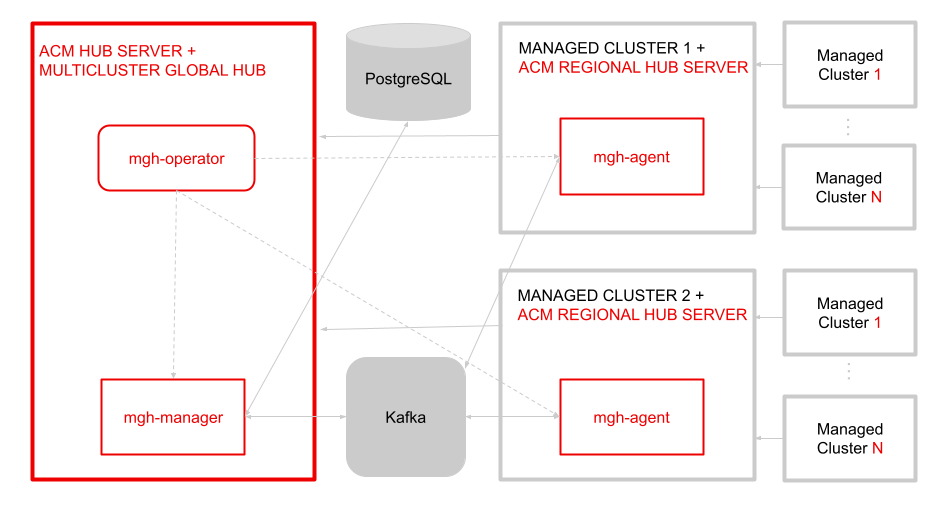

# Multicluster Global Hub Overview
[](https://prow.ci.openshift.org/?repo=stolostron%2F${multicluster-global-hub})
[](https://sonarcloud.io/dashboard?id=open-cluster-management_hub-of-hubs)
[](https://pkg.go.dev/github.com/stolostron/multicluster-global-hub)
[](/LICENSE)

This document attempts to explain how the different components in multicluster global hub come together to deliver multicluster management at very high scale. The multicluster-global-hub operator is the root operator which pulls in all things needed.

## Conceptual Diagram
 


### Multicluster Global Hub Operator
Operator is for multicluster global hub. It is used to deploy all required components for multicluster management. The components include multicluster-global-hub-manager in the global hub cluster and multicluster-global-hub-agent in the regional hub clusters.

The Operator also leverages the manifestwork to deploy the Advanced Cluster Management for Kubernetes in the managed cluster. So the managed cluster is switched to a standard ACM Hub cluster (regional hub cluster).

### Multicluster Global Hub Manager
The manager is used to persist the data into the postgreSQL. The data is from Kafka transport. The manager is also used to post the data to Kafka transport so that it can be synced to the regional hub clusters.

### Multicluster Global Hub Agent
The agent is running in the regional hub clusters. It is responsible to sync-up the data between the global cluster hub and the regional hub clusters. For instance, sync-up the managed clusters' info from the regional hub clusters to the global hub cluster and sync-up the policy or application from the global hub cluster to the regional hub clusters.

### Multicluster Global Hub Observability
Grafana runs on the global hub cluster, as the main service for Global Hub Observability. The Postgres data collected by the Global Hub Manager services as its default DataSource. By exposing the service via route(`multicluster-global-hub-grafana`), you can access the global hub grafana dashboards just like accessing the openshift console.

## Quick Start Guide

### Prerequisites

1. Connect to a Kubernetes cluster with `kubectl`
2. ACM or OCM is installed on the Kubernetes cluster
3. PostgreSQL is installed and a database is created for the multicluster global hub. A secret `storage-secret` contains the credential is created in `open-cluster-management` namespace. The secret `database_uri` format like `postgres://<user>:<password>@<host>:<port>/<database>?sslmode=<mode>` and you can provide the optional `ca.crt` based on the [sslmode](https://www.postgresql.org/docs/current/libpq-connect.html#LIBPQ-CONNSTRING):

```bash
kubectl create secret generic storage-secret -n "open-cluster-management" \
    --from-literal=database_uri=<postgresql-uri> \
    --from-file=ca.crt=<CA-for-postgres-server>
```
> You can run this sample script `./operator/config/samples/storage/deploy_postgres.sh`(Note: the client version of kubectl must be v1.21+) to install postgres in `hoh-postgres` namespace and create the secret `storage-secret` in namespace `open-cluster-management` automatically. To override the secret namespace, set `TARGET_NAMESPACE` environment variable to the ACM installation namespace before executing the script. By default, we are using `ClusterIP` for accessing the postgres database, because we assume run this sample script in global hub cluster. If you want to deploy postgres in another cluster, you can consider to use the service type with `nodePort` or `LoadBalancer`. For more information, please refer to [this document](./doc/README.md#access-to-the-provisioned-postgres-database).


4. Kafka is installed and three topics `spec` `status` and `event` are created, also a secret with name `transport-secret` that contains the kafka access information should be created in `open-cluster-management` namespace:

```bash
kubectl create secret generic transport-secret -n "open-cluster-management" \
    --from-literal=bootstrap_server=<kafka-bootstrap-server-address> \
    --from-literal=CA=<CA-for-kafka-server>
```
> As above, You can run this sample script `./operator/config/samples/transport/deploy_kafka.sh` to install kafka in kafka namespace and create the secret `transport-secret` in namespace `open-cluster-management` automatically. To override the secret namespace, set `TARGET_NAMESPACE` environment variable to the ACM installation namespace before executing the script.

### Run the operator in the cluster

_Note:_ You can also install Multicluster Global Hub Operator from [Operator Hub](https://docs.openshift.com/container-platform/4.6/operators/understanding/olm-understanding-operatorhub.html) if you have ACM installed in an OpenShift Container Platform, the operator can be found in community operators by searching "multicluster global hub" keyword in the filter box, then follow the document to install the operator.

Follow the steps below to instal Multicluster Global Hub Operator in developing environment:

1. Check out the multicluster-global-hub repository
```bash
git clone git@github.com:stolostron/multicluster-global-hub.git
cd multicluster-global-hub/operator
```

2. Build and push your image to the location specified by `IMG`:

```bash
make docker-build docker-push IMG=<some-registry>/multicluster-global-hub-operator:<tag>
```

3. Deploy the controller to the cluster with the image specified by `IMG`:

```bash
make deploy IMG=<some-registry>/multicluster-global-hub-operator:<tag>
```

_Note:_ Specify `TARGET_NAMESPACE` environment variable if you're trying to deploy the operator into another namespace rather than `open-cluster-management`, keep in mind the namespace must be the ACM installation namespace.

4. Install instance of custom resource:

```bash
kubectl apply -k config/samples/
```

### Uninstall the operator

1. Delete the multicluster-global-hub-operator CR:

```bash
kubectl delete mgh --all
```

2. Delete the multicluster-global-hub-operator:

_Note:_ This will delete Multicluster Global Hub Operator and the CRD from the cluster.

```bash
make undeploy
```

# Contributing

Go to the [Contributing guide](CONTRIBUTING.md) to learn how to get involved.
