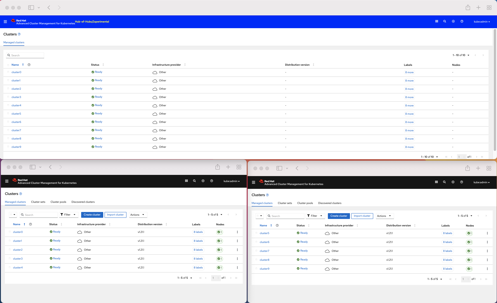

# Single Desktop Hub-of-Hubs demo

In this demo the demonstrator shows three ACM Web consoles arranged inside a single desktop (window). While it is a more convenient and a faster way to show how the directives and the status are propagated between the Hub of Hubs and the Hubs, the audience can be confused to think that the users of Hub-of-Hubs actually observe all the three Web consoles. In reality, the three Web consoles are observed by different users, who issue different CLI commands and perform different actions in UI. The demonstrator should stress this point to the audience. Alternatively, consider using the [multiple-desktops demo](../multiple_desktops), to demonstrate the separation of the UI and CLI of the different users.



# Description

1. The user observes all the managed clusters of the connected hubs in the Clusters view of the Hub-of-Hubs Web console.
1. The user defines a policy, a placement rule and a placement rule binding in their namespace, by Hub-of-Hubs Web console or
by CLI (`kubectl`, `oc`) of the Hub-of-Hubs OpenShift cluster.
1. The user observes policy compliance status in the Web console of Hub of Hubs and in the Web console of the hubs connected to the Hub of Hubs.

## Prerequisites

See [the common prerequisites for Hub-of-Hubs demos](../README.md#prerequisites).

## Setup

See [the common setup instructions for Hub-of-Hubs demos](../README.md#setup).

## The script

[The script](script.md).

To run the commands of the demo as as shell script, run the the shell script below **in this directory**.
The shell script uses [demo-magic](https://github.com/paxtonhare/demo-magic),
you need to press Enter to run commands one by one.
The redirection of the standard error stream to `/dev/null` is required to suppress
throttling warnings that expose the API server URL.
Exposing API server URL could be undesirable for security.

```
./run.sh 2> /dev/null
```

## Cleanup

```
./clean.sh
```
