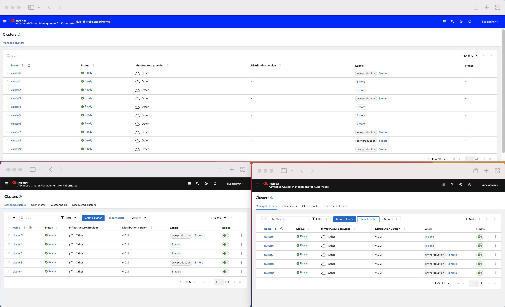
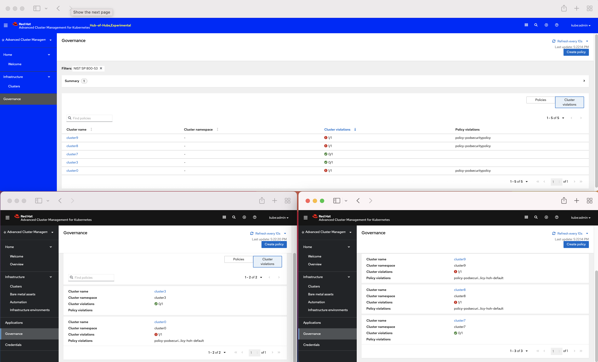
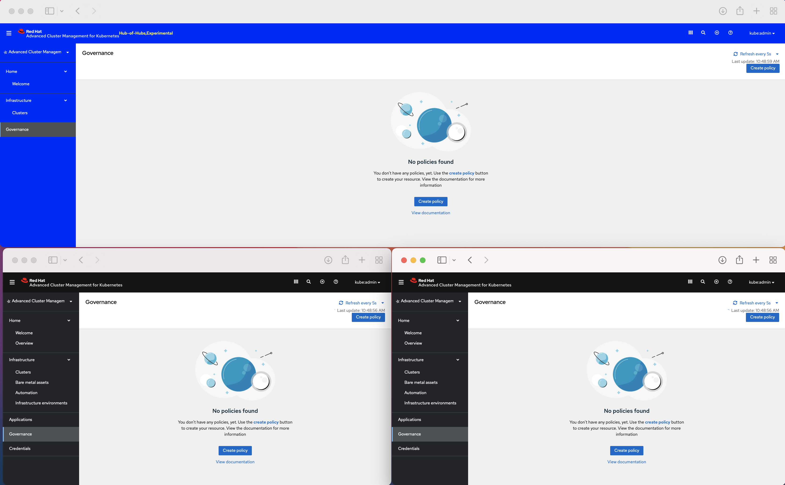

# The Hub-of-Hubs single-desktop basic-demo script

1.  Login into the Web console of `hoh` as the `kubeadmin` user. The Hub-of-Hubs Web console has the same URL as the original [ACM Web console URL](https://access.redhat.com/documentation/en-us/red_hat_advanced_cluster_management_for_kubernetes/2.4/html/web_console/web-console#accessing-your-console).

    If you cannot login as `kubeadmin`, [add an alternative user as the admin to Hub-of-Hubs RBAC](https://github.com/stolostron/hub-of-hubs-rbac#update-role-bindings-or-role-definitions).

1.  Observe managed clusters in the Web console of `hoh`, of `hub1` and of `hub2`.
    Note that the Web console of `hoh` contains managed clusters of both `hub1` and `hub2`.

    The screenshot below shows an example setup. The Web console of `hub1` is at the bottom left quarter, `hub1` manages clusters `cluster0`-`cluster4`.
    The Web console of `hub2` is at the bottom right quarter, `hub2` manages clusters `cluster5`-`cluster9`.
    The Web console of `hoh`, with a distinctive blue color design, appears at the top half of the screen. It contains the clusters of both `hub1` and `hub2`,
    namely `cluster0`-`cluster9`.

    


1.  Note that the managed clusters on `hoh` are not represented by Kubernetes Custom Resources (not stored in etcd), and cannot be queried by `kubectl`:

    ```
    $ kubectl get managedcluster --kubeconfig $TOP_HUB_CONFIG
    No resources found
    ```

1.  Add the `env=production` label to some of the managed clusters of `hub1` and `hub2`, either by `kubectl` or [in the Web console](https://access.redhat.com/documentation/en-us/red_hat_advanced_cluster_management_for_kubernetes/2.4/html/clusters/managing-your-clusters#managing-cluster-labels) of `hub1`/`hub2`.

    ```
    $ kubectl label managedcluster <some-cluster> env=production --kubeconfig $HUB1_CONFIG
    ```

1.  Note that the new labels appear in the Cluster View of `hoh`.

    The screenshot below shows the previous example setup with labels `env=production` on clusters `cluster0`, `cluster3`, `cluster7`, `cluster8` and `cluster9`.
    The labels appear in the Cluster View of `hub1`, `hub2` and `hoh`.

    

1.  Create a policy, a placement rule and a placement binding in `hoh` cluster by `kubectl`. The policy used in the instructions below is an [ACM pod security policy](https://access.redhat.com/documentation/en-us/red_hat_advanced_cluster_management_for_kubernetes/2.4/html/governance/governance#pod-security-policy). The placement rule selects clusters with the `env=production` label.

    ```
    $ kubectl apply -f https://raw.githubusercontent.com/stolostron/hub-of-hubs/main/demos/policy-psp.yaml --kubeconfig $TOP_HUB_CONFIG
    policy.policy.open-cluster-management.io/policy-podsecuritypolicy created
    placementbinding.policy.open-cluster-management.io/binding-policy-podsecuritypolicy created
    placementrule.apps.open-cluster-management.io/placement-policy-podsecuritypolicy created
    ```

1.  Observe the policy in the Web console of `hoh`, `hub1` and `hub2`.

    The screenshot below shows `policy-podsecuritypolicy` in the Governance view of `hoh`, of `hub1` and of `hub2`.
    The policy is applied to two managed clusters of `hub1` and to three managed clusters of `hub2`.
    One managed cluster in `hub1` and two managed clusters in `hub2` violate the policy.
    Note that you can see in the Governance view of `hoh` aggregation of the managed clusters the policy is applied to.
    You can also observe in the Governance view of `hoh` aggregation of the cluster violations.
    In `hoh`, the policy is shown as applied to five clusters (in total) and it has three (in total) cluster violations.

    

1.  Click on the _Cluster violations_ link in the Governance view of `hoh`, `hub1` and `hub2`.
    Note that all the managed clusters labeled with `env=production` from both `hub1` and `hub2` appear in the Cluster violiations view of `hoh`.

    The screenshot below shows the Cluster violations view of `hoh`, of `hub1` and of `hub2`. The managed clusters labeled with `env=production`, namely
    `cluster0`, `cluster3`, `cluster7`, `cluster8` and `cluster9`, appear in the violations view of `hoh`. Clusters `cluster0`, `cluster8` and `cluster9`
    appear as noncompliant in the Cluster violations view of `hoh`, and in the respective views of `hub1` and `hub2`.


    

1.  Change compliance of one of the managed clusters of `hub1`. To make the managed cluster compliant, run:

    ```
    $ kubectl apply -f https://raw.githubusercontent.com/stolostron/hub-of-hubs/main/demos/psp.yaml --kubeconfig <a managed cluster config>
    ```

1.  Observe changes of the compliance status in the Web console of `hoh` and `hub1`.

1.  Change the remediation action in the Web console of `hoh` to `enforce`. Observe propagation of the changes and the status.

    The screenshot below shows the policy in the Governance view of `hoh`, of `hub1` and of `hub2`. The remediation action is `enforce` in
    all the views, and there are no cluster violations.

    

1.  Delete the policy in the Web console of `hoh`. Observe propagation of the deletion to `hub1` and `hub2`.

    
